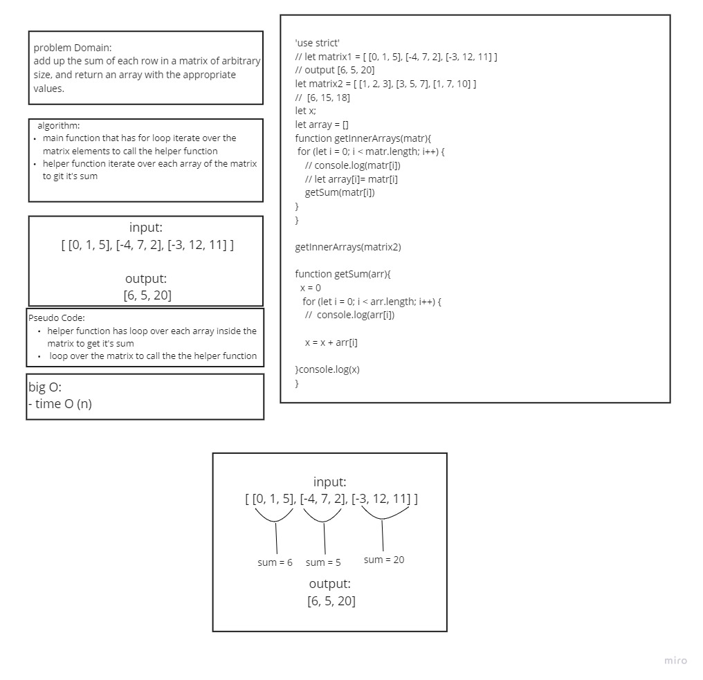

# Mock Interview

**Interview questions**

- The first interviewer will ask [this question](https://codefellows.github.io/common_curriculum/data_structures_and_algorithms/Code_401/class-04/interview-01.html) (Ahmad asked Aya)
- The second interviewer will ask [this question]https://codefellows.github.io/common_curriculum/data_structures_and_algorithms/Code_401/class-04/interview-02.html) Aya asked Ahmad

plz check my [Whiteboard Rubric](https://docs.google.com/spreadsheets/d/1ceCiI9reU6JBUlkm_hy_HEeCdXqojNiSEI50ukcDJjc/edit#gid=0 (Links to an external site.)

 )

here is my white board for this challenge:

