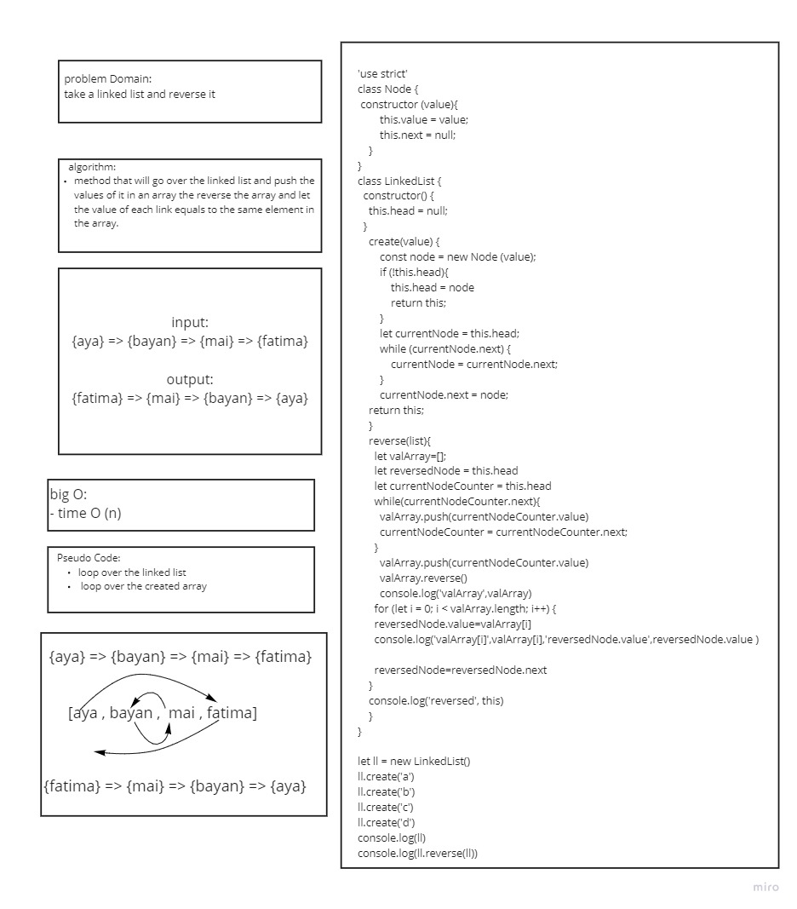

# Mock Interview

**Interview questions**

- The first interviewer will ask [this question](https://codefellows.github.io/common_curriculum/data_structures_and_algorithms/Code_401/class-09/interview-01.html) (Bayan asked Aya)
- The second interviewer will ask [this question](https://codefellows.github.io/common_curriculum/data_structures_and_algorithms/Code_401/class-09/interview-02.html) Aya asked Bayan

here is my white board for this challenge:

plz check my [Whiteboard Rubric](https://docs.google.com/spreadsheets/d/1Lf-sV0lFYH_PgO8dDKUsx5yvCkqrgGvA12Zk1e4bZIM/edit?usp=sharing)
